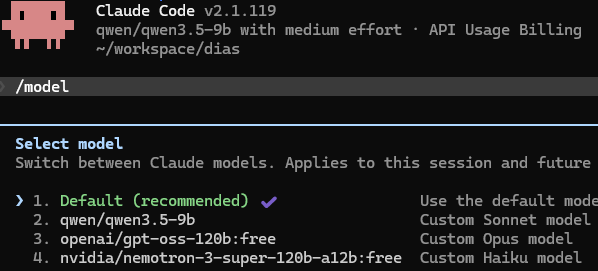

# Claude Code + LiteLLM Hybrid Routing Setup

## What this is
This setup enables hybrid model routing for Claude Code: the Claude Code client sends API requests to a LiteLLM proxy, which routes them to multiple backend model providers (including local LM Studio instances and cloud-based OpenRouter) that support the Anthropic API contract. This lets you use free/private models with Claude Code without native Anthropic API access.

## Prerequisites
- Python 3.8+ and pip
- LiteLLM proxy installed
- Windows is not natively supported, but WSL (Windows Subsystem for Linux) works correctly

Follow the [LiteLLM Proxy Quick Start](https://docs.litellm.ai/docs/proxy/quick_start) for installation instructions.

## Supported backends
LM Studio (local model hosting) and OpenRouter (cloud model aggregation) natively support the Anthropic API contract required by Claude Code, so no additional adapter layers are needed for these backends.

## Config
The `litellm_config.yaml` file defines all available models and routing rules for the LiteLLM proxy. Full content:
```yaml
model_list:
  # OpenRouter models
  - model_name: openai/gpt-oss-120b:free
    litellm_params:
      model: anthropic/openai/gpt-oss-120b:free # "anthropic/" prefix forces Anthropic-compatible API contract for Claude Code
      api_key: os.environ/OPENROUTER_API_KEY
      api_base: https://openrouter.ai/api # Backend endpoint URL for OpenRouter

  - model_name: nvidia/nemotron-3-super-120b-a12b:free
    litellm_params:
      model: anthropic/nvidia/nemotron-3-super-120b-a12b:free # "anthropic/" prefix forces Anthropic-compatible API contract for Claude Code
      api_key: os.environ/OPENROUTER_API_KEY
      api_base: https://openrouter.ai/api # Backend endpoint URL for OpenRouter

  # LM Studio local models
  - model_name: qwen/qwen3.5-9b
    litellm_params:
      model: anthropic/qwen/qwen3.5-9b # "anthropic/" prefix forces Anthropic-compatible API contract for Claude Code
      api_key: dummy
      api_base: http://localhost:1234 # Backend endpoint URL for LM Studio local model
      # custom_llm_provider: openai
```

Explanation of config sections:
- `model_list`: Lists all models exposed to Claude Code via the proxy
  - OpenRouter entries: Use `anthropic/` model prefix to enforce Anthropic API compatibility, pull API keys from the `OPENROUTER_API_KEY` environment variable, route requests to OpenRouter's API endpoint
  - LM Studio entry: Uses `anthropic/` model prefix, dummy API key (local LM Studio instances require no authentication), routes to the default LM Studio local endpoint `http://localhost:1234`

## Start the proxy
Start the LiteLLM proxy with the configuration file using this command:
```bash
litellm --config litellm_config.yaml
```
The proxy will start listening on the default port (4000) and expose all configured models to Claude Code.

## Configure Claude Code
Configure Claude Code to route requests through the LiteLLM proxy by sourcing the `setenv` script in your current shell:
```bash
. ./setenv
# or
source ./setenv
```

This sets the following environment variables (explained per variable):
- `ANTHROPIC_API_KEY`: Set to empty string (required by Claude Code even when using local/unauthenticated backends)
- `ANTHROPIC_BASE_URL`: Points Claude Code to the LiteLLM proxy at `http://localhost:4000`
- `ANTHROPIC_AUTH_TOKEN`: Dummy value required by Claude Code for proxy authentication
- `ANTHROPIC_DEFAULT_OPUS_MODEL`: Default Opus-tier model (OpenRouter's `openai/gpt-oss-120b:free`)
- `ANTHROPIC_DEFAULT_SONNET_MODEL`: Default Sonnet-tier model (local LM Studio `qwen/qwen3.5-9b`)
- `ANTHROPIC_DEFAULT_HAIKU_MODEL`: Default Haiku-tier model (OpenRouter's `nvidia/nemotron-3-super-120b-a12b:free`)
- `CLAUDE_CODE_SUBAGENT_MODEL`: Model used for Claude Code subagent tasks (OpenRouter's `openai/gpt-oss-120b:free`)

## AI-assisted setup prompt
If you need to adapt this setup to your local environment (e.g., different LM Studio port, custom models, or additional backends), use this example prompt with an AI assistant:
```
Please adapt the litellm_config.yaml and setenv files in this directory to work with my local LM Studio instance running on port [YOUR_LM_STUDIO_PORT], using the model [YOUR_LOCAL_MODEL_NAME]. My OpenRouter API key is [YOUR_OPENROUTER_API_KEY] if using cloud models. Preserve the existing Anthropic API compatibility prefixes.
```

## Screenshots


