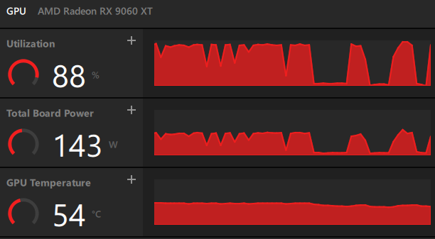

# Local AI

## Hardware
- Radeon 9060XT 16GB VRAM (Adrenalin 26.3.1)
- AMD Ryzon 5600G + 64GB RAM

## Model
- LM Studio + ROCm llama.cpp (Windows) v2.13.0
- qwen/qwen3.5-9b 6_K (8GB model + 8GB context)

# CLI comparison
| Tool        | Pros                                                                 | Cons                                                                 |
|-------------|----------------------------------------------------------------------|----------------------------------------------------------------------|
| Claude Code | sophisticated                                                        | Heavy system prompt with long prefilling                             |
| OpenCode    | Claude Code compatible; significantly fewer system prompt tokens and much better prefill performance than Claude Code | seems to rely on more output, making it a bottleneck                 |
| Aider       | for straight forward and simple instructions                         | No reasoning   |

## Typical Performance
```
prompt eval time =   11656.03 ms / 11364 tokens (    1.03 ms per token,   974.95 tokens per second)
       eval time =    4174.98 ms /   141 tokens (   29.61 ms per token,    33.77 tokens per second)
```


